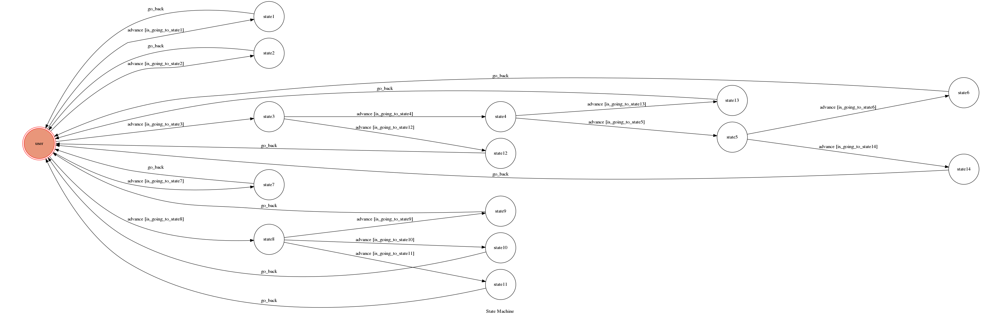

# MoomiChatBot
A messenger chat bot for Moomi's fan page. Also a project for Theory of Computation in CSIE, NCKU.
### How to Run Locally
```bash
./ngrok http 5000
```
#### How to Run the Server
```bash
python3 app.py
```
### How to Interact with Chatbot
1. 嗨
  * This will give you a simple introduce of the page, and how to interact with the bot
2. 抽姆咪
  * This will send you a photo of the cat randomly
3. 我們一起學貓叫
  * This will start a game, you'll have to sing along with the bot
  * If you cannot sing it correctly, you will lose the game
4. 我想要女主人
  * This will parse the ptt website of Beauty and send you a photo randomly
5. 測驗
  * This will throw you a exam, and it is displayed in buttons
  
### Finite State Machine


### Warning
**DON'T SEND ANYTHING THAT IS NOT IN TEXT FORM**
